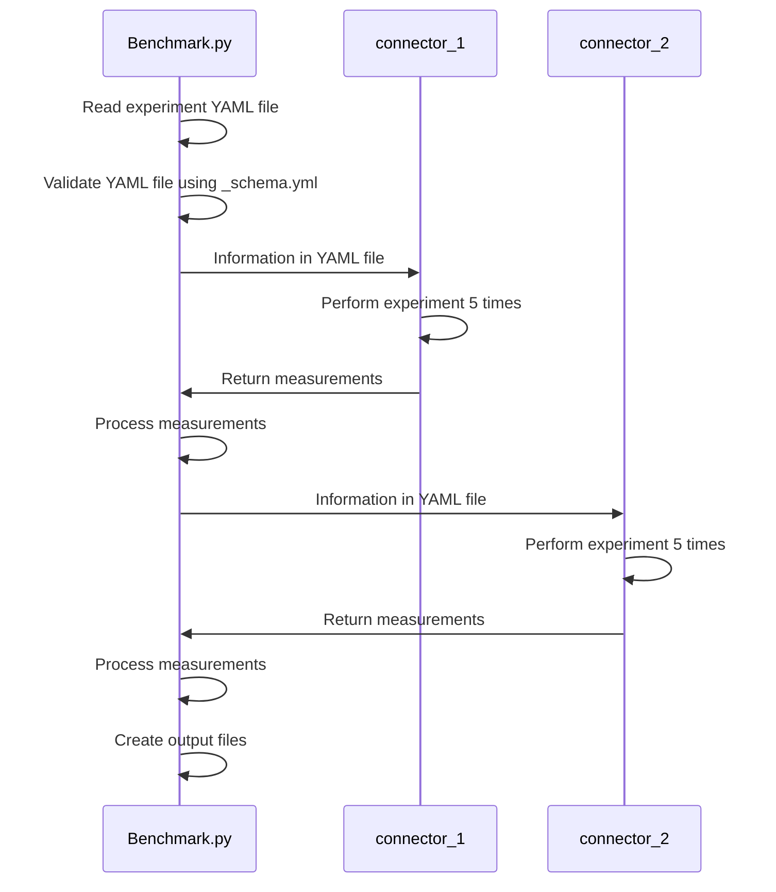

[[_TOC_]]

*Continuous Benchmarking* (CB) is the automated process of repetetive benchmarking and report generation.
mu*t*able uses CB to detect and avoid performance regression.
Additionally -- as a bonus -- our CB infrastructure tracks performance changes over time and gives a first visual overview over the collected benchmark data.

## Writing Benchmarks

We implement our own benchmarking infrastructure in `benchmark/Benchmark.py`.
Benchmarks are written in a declarative way: you specify *what* you want to benchmark, and the infrastructure takes care of *how* to perform these benchmarks.

### Benchmark Structure

*Benchmarks* are grouped into *benchmark suites*.
A single *benchmark* belongs to exactly one *benchmark suite* and consists of one or more YAML files.
Each file specifies an *experiment* and belongs to exactly one *benchmark*.
An *experiment* is composed of one or more *cases*.
This is depicted in the following figure:

```
benchmark suite
└── benchmark
    └── experiment (YAML file)
        └── cases
```

New benchmarks are added by adding a new experiment YAML file, that declares the benchmark suite and benchmark it belongs to.
With this design, the YAML files are self-contained and don't require an outside declaration of a benchmark or benchmark suite.

### Experiment File Format

Experiment files are YAML files with a relatively simple schema defined in `benchmark/_schema.yml`.
Our benchmark script checks given experiment files and only executes the ones that are valid according to this schema.<br/>
Here is an example of such an experiment YAML file:

```yml
description: Order by single attribute of type INT(4).    # Description of this experiment.  Mandatory.
version: 42                                               # The version of this benchmark. Optional.
suite: operators                                          # The suite this experiment belongs to.  Mandatory.
benchmark: ordering                                       # The benchmark this experiment belongs to.  Mandatory.
name: single INT(4)                                       # An experiment name.  Optional.  Relative path to file if not specified.
readonly: true                                            # Whether this experiment is read-only.  Optional, defaults to false.
chart:                                                    # Chart configuration.  Every field is optional.
    x:                                                    # For X-axis
        scale: linear                                     # One of "linear", "log"
        type: Q                                           # One of Q (quantitative), O (ordinal), N (nominal), or T (temporal)
        label: Scale Factor                               # Axis label
    y:                                                    # For Y-axis
        scale: linear
        type: Q
        label: 'Execution time [ms]'
    # Defaults: scale is "linear", type is "Q", label is "X" or "Y"
data:                                                     # Definition of the tables this experiment uses.
    'Distinct_i32':                                       # Name of this table.
        file: 'benchmark/operators/data/Distinct_i32.csv' # Relative path to the file containing the table data
        format: 'csv'                                     # Format of the file. Optional, defaults to 'csv'.
        delimiter: ','                                    # Delimiter of the file. Optional, defaults to ','.
        header: 1                                         # Whether the file has a header line. 1=true, 0=false. Optional, defaults to 0.
        attributes:                                       # Map from attribute name to its type.
            'id': 'INT NOT NULL'
            'n1': 'INT NOT NULL'
            'n10': 'INT NOT NULL'
            'n100': 'INT NOT NULL'
            'n1000': 'INT NOT NULL'
            'n10000': 'INT NOT NULL'
            'n100000': 'INT NOT NULL'
        scale_factors:                                    # Map from case-name to scale factor.
            0.0: 0.0
            0.1: 0.1
            0.2: 0.2
            0.3: 0.3
            0.4: 0.4
            0.5: 0.5
            0.6: 0.6
            0.7: 0.7
            0.8: 0.8
            0.9: 0.9
            1.0: 1.0
 # The systems this experiment should be run on. All systems are optional. Each system may have system-specific parameters/arguments.
systems:
    mutable:                                              # System name.
        configurations:                                   # Different experiment configurations.
            'Interpreter':                                # Configuration name.
                args: --backend Interpreter               # Supplementary command line arguments.  Optional.
                pattern: '^Execute query:.*'              # The pattern to extract timings from the output.  Mandatory.
            'WasmV8, Row':
                args: --backend WasmV8 --data-layout Row
                pattern: '^Execute machine code:.*'
            'WasmV8, PAX4M':
                args: --backend WasmV8 --data-layout PAX4M
                pattern: '^Execute machine code:.*'
        cases:                                            # The cases of this experiment: a mapping from case-name to SQL query.  Mandatory.
            0.0: SELECT id FROM Distinct_i32 ORDER BY n100000;
            0.1: SELECT id FROM Distinct_i32 ORDER BY n100000;
            0.2: SELECT id FROM Distinct_i32 ORDER BY n100000;
            0.3: SELECT id FROM Distinct_i32 ORDER BY n100000;
            0.4: SELECT id FROM Distinct_i32 ORDER BY n100000;
            0.5: SELECT id FROM Distinct_i32 ORDER BY n100000;
            0.6: SELECT id FROM Distinct_i32 ORDER BY n100000;
            0.7: SELECT id FROM Distinct_i32 ORDER BY n100000;
            0.8: SELECT id FROM Distinct_i32 ORDER BY n100000;
            0.9: SELECT id FROM Distinct_i32 ORDER BY n100000;
            1.0: SELECT id FROM Distinct_i32 ORDER BY n100000;
    PostgreSQL:
        cases:
            0.0: SELECT id FROM "Distinct_i32" ORDER BY n100000;
            0.1: SELECT id FROM "Distinct_i32" ORDER BY n100000;
            0.2: SELECT id FROM "Distinct_i32" ORDER BY n100000;
            0.3: SELECT id FROM "Distinct_i32" ORDER BY n100000;
            0.4: SELECT id FROM "Distinct_i32" ORDER BY n100000;
            0.5: SELECT id FROM "Distinct_i32" ORDER BY n100000;
            0.6: SELECT id FROM "Distinct_i32" ORDER BY n100000;
            0.7: SELECT id FROM "Distinct_i32" ORDER BY n100000;
            0.8: SELECT id FROM "Distinct_i32" ORDER BY n100000;
            0.9: SELECT id FROM "Distinct_i32" ORDER BY n100000;
            1.0: SELECT id FROM "Distinct_i32" ORDER BY n100000;
    DuckDB:
        cases:
            0.0: SELECT id FROM "Distinct_i32" ORDER BY n100000;
            0.1: SELECT id FROM "Distinct_i32" ORDER BY n100000;
            0.2: SELECT id FROM "Distinct_i32" ORDER BY n100000;
            0.3: SELECT id FROM "Distinct_i32" ORDER BY n100000;
            0.4: SELECT id FROM "Distinct_i32" ORDER BY n100000;
            0.5: SELECT id FROM "Distinct_i32" ORDER BY n100000;
            0.6: SELECT id FROM "Distinct_i32" ORDER BY n100000;
            0.7: SELECT id FROM "Distinct_i32" ORDER BY n100000;
            0.8: SELECT id FROM "Distinct_i32" ORDER BY n100000;
            0.9: SELECT id FROM "Distinct_i32" ORDER BY n100000;
            1.0: SELECT id FROM "Distinct_i32" ORDER BY n100000;
    HyPer:
        cases:
            0.0: SELECT id FROM "Distinct_i32" ORDER BY n100000;
            0.1: SELECT id FROM "Distinct_i32" ORDER BY n100000;
            0.2: SELECT id FROM "Distinct_i32" ORDER BY n100000;
            0.3: SELECT id FROM "Distinct_i32" ORDER BY n100000;
            0.4: SELECT id FROM "Distinct_i32" ORDER BY n100000;
            0.5: SELECT id FROM "Distinct_i32" ORDER BY n100000;
            0.6: SELECT id FROM "Distinct_i32" ORDER BY n100000;
            0.7: SELECT id FROM "Distinct_i32" ORDER BY n100000;
            0.8: SELECT id FROM "Distinct_i32" ORDER BY n100000;
            0.9: SELECT id FROM "Distinct_i32" ORDER BY n100000;
            1.0: SELECT id FROM "Distinct_i32" ORDER BY n100000;
```

### Detailed explanation of the file format

#### Experiment definition

- `description`: A textual description of the experiment.
- `version`: Version of this experiment. Should be incremented whenever the benchmark is changed *semantically*, e.g. by measuring a different property (machine code execution time versus query time) or by changing the command line arguments in a performance relevant way (`--data-layout Row` versus `--data-layout PAX4M`).
- `suite`: The name of the benchmark suite this experiment belongs to.
- `benchmark`: The name of the benchmark this experiment belongs to.
- `readonly`: Whether this experiment is read-only. Defaults to `false`. If the experiment is not read-only, a new database instance is created and data is loaded for each case to guarantee isolation. If the experiment is read-only, a single database instance is created and data is loaded once for the entire experiment. Read-only experiments should always be declared `readonly: true` to speed up the benchmarking process!

#### Chart

The purpose of these fields is to provide information on how to render a chart (its axes) to visualize our measurements.
The fields `scale`, `type`, and `label` can be provided for the x- and y-axis separately.
Every field is optional.

- `scale`: The scale of the axis. Can be either 'linear' or 'log'.
- `type`: The type of the axis. Can be one of Q (quantitative), O (ordinal), N (nominal), or T (temporal).
- `label` A label to name the axis.
  Defaults: scale is 'linear', type is 'Q', label is 'X' or 'Y'.

|                                | x-axis continuous (T or Q) | x-axis discrete (O or N) |
|--------------------------------|----------------------------|--------------------------|
| **y-axis continuous (T or Q)** | Line Chart                 | Bar Chart                |
| **y-axis discrete (O or N)**   | Line Chart                 | Scatter Plot             |

#### Data

The `data` field contains information about all tables that are used in the experiment.
It is a map from table name to table definition.
Each table definition has the following fields:

- `file`: A relative path to the file containing the table data. If it is not provided, our benchmarking script constructs it as `benchmark/<SUITE>/data/<TABLE>.csv`.
- `format`: The format of the file. Optional, defaults to 'csv'.
- `delimiter`: The delimiter of the file. Optional, defaults to ','.
- `header`: Whether the table file has a header line. 1=true, 0=false. Optional, defaults to 0.
- `attributes`: A map from an attribute name to its type. Valid types are `INT`, `BIGINT`, `FLOAT`, `DOUBLE`, `DECIMAL n m`, `CHAR n`, `DATE`, `DATETIME` (where `n` and `m` are integers defining the size). Additionally, constraints `NOT NULL`, `UNIQUE`, `PRIMARY KEY` can be added after the type, separated by a simple space character.
- `scale_factors`: A map from a case-name to a scale factor. Optional. This is particularly useful to load only a portion of a table for a specific case. For example, a scale factor of `0.5` would only load half of the data in the specified table file. The case-names used in this map must be the same as in the `cases` field of a `system`.

#### Systems

We run our benchmarks not only on mu*t*able, but also on other systems to compare their performance.
Each system has different properties and therefore specific parameters for experiment execution.

##### mu*t*able

- `configurations`: A map from a configuration name to a `configuration` that contains the `pattern` and `args`. The experiment is performed once per configuration.
    - `pattern`: A regular expression for the [Python `re` library](https://docs.python.org/3/library/re.html?highlight=regex) to find measurements in the database system's output.
    - `args`: Supplementary command line arguments to append when starting the database system. These are appended *to all configurations*.
- `cases`: A map of case key to SQL query. The key can be anything (e.g. string, number, date, ...) as only the key's string representation is used.

##### PostgreSQL

- `cases`: A map of case key to SQL query. The key can be anything (e.g. string, number, date, ...) as only the key's string representation is used.

##### DuckDB

- `cases`: A map of case key to SQL query. The key can be anything (e.g. string, number, date, ...) as only the key's string representation is used.

##### HyPer

- `cases`: A map of case key to SQL query. The key can be anything (e.g. string, number, date, ...) as only the key's string representation is used.

### Benchmark Directory Structure

Experiments of the same benchmark suite are organized in one directory, that is named after the benchmark suite.
(This is just a convention. As experiment YAML files are self-contained, they could be placed anywhere.)

#### Benchmark Data

Every experiment is based on a schema and initial data set as specified in the `data` field of the YAML file.
The subdirectory `benchmark/<SUITE>/data/` contains these table files.
If this is not the case, the generation of data must be performed manually using the provided script (`gen.py`)!

#### Example

Below is the current directory structure of our benchmark directory:

```plain
benchmark
├── Benchmark.py
├── job
│   ├── data
│   ├── q1.yml
│   ├── ...
│   └── q33.yml
├── job-light
│   ├── data
│   ├── job-light_1.yml
│   ├── job-light_2.yml
│   ├── job-light_3.yml
│   └── job-light_4.yml
├── operators
│   ├── data
│   ├── equi_join_n2m.yml
│   ├── equi_join_pk_fk.yml
│   ├── gen.py
│   ├── group_by_aggregates.yml
│   ├── group_by_i32_distinct.yml
│   ├── group_by_i32_multiple.yml
│   ├── group_by_i32_single.yml
│   └── order_by_i32_distinct.yml
│   └── order_by_i32_multiple.yml
│   └── order_by_i32_single.yml
│   └── selection_multi_i32_varying_both.yml
│   └── selection_multi_i32_varying_first_fixed_second.yml
│   └── selection_range_onesided_d.yml
│   └── selection_range_onesided_f.yml
│   └── selection_range_onesided_i32.yml
│   └── selection_range_onesided_i64.yml
│   └── order_by_i32_distinct.yml
├── plan-enumerators
│   ├── data
│   ├── chain.yml
│   ├── clique.yml
│   ├── cycle.yml
│   └── star.yml
├── tpc-h
│   ├── data
│   ├── compile_q1.yml
│   ├── q1.yml
│   ├── q12.yml
│   ├── q14.yml
│   ├── q3.yml
│   ├── q6.yml
└── _schema.yml
```

We can see five benchmark suites (`job`, `job-light`, `operators`, `plan-enumerators`, and `tpc-h`).
Within each benchmark suite directory we find several experiment YAML files and the `data/` directory.
The benchmark suite `operators` provides `gen.py` to generate the benchmark data in its `operators/data/` directory.

## Database Connectors

To immediately compare our system to others, we provide a simple means of running the experiments in other systems.
Currently, we implemented a comparison to **PostgreSQL**, **DuckDB** and **HyPer**.
By default, an experiment is run on all systems as specified in its YAML file.
The `--no-compare` flag on the benchmark script skips comparison and only executes the queries on mu*t*able.
Because each system is unique and has different properties, we implement a *database-connector* for each system located in `benchmark/database_connectors`.
Each *connector* provides a connection to its system and internally handles how exactly the benchmark is executed, in particular:

- How to connect to the system
- How to set up the tables before query execution
- How to clean up after execution
- How to measure the execution time for a query

The main benchmark script reads all specified experiment YAML files and checks whether they fulfill the schema.
For all valid experiments, it forwards the information to all *database-connectors*.
After the *database-connectors* are done with executing the queries (cases), they return the measurements to the benchmark script, which processes them further.
Measurements can be written into a CSV file (if `--output` is set) or into a PGSQL file (if `--pgsql` is set) that we use to insert all measurements into our continuous benchmarking PostgreSQL database.

#### Example



### Systems Setup

- **mu*t*able**: To be able to run benchmarks on mu*t*able, it must be built before. The directory is assumed to be `build/release`.
- **DuckDB**: To be able to run DuckDB benchmarks, the `duckdb` binary must be in `benchmark/database_connectors/`. The download to this binary can be found on the [DuckDB Installation](https://duckdb.org/docs/installation/).
- **PostgreSQL**: To be able to run PostgreSQL benchmarks, the `psql` binary must be in the `$PATH`, the PostgreSQL server must have been initialized and running, and the user `postgres` must have access to the server. (You can verify everything is properly set up by running `psql -U postgres`.)  Important: PostgreSQL needs some more specific configuration, please look at [PostgreSQL Connector](database_connectors/postgresql.md) for more information.
- **Hyper**: We use the [Tableau Hyper API](https://help.tableau.com/current/api/hyper_api/en-us/index.html) to execute queries in HyPer. The Python API is already included in our Pipenv.

### Adding systems

To add a new system to our benchmarks, the first step is to ensure that the system is installed and can be run.
Afterwards, a *database-connector* has to be implemented for that system, which is in charge of connecting to the database, executing the queries, measuring the execution times, and returning the measurements in the expected format.
Then, the *connector* can be added in the main benchmark script.
Finally, the new *connector* can be added in the experiment YAML files in the `systems` map with the needed parameters.

## Running the Benchmarks

The benchmarks are run with one main script `benchmark/Benchmark.py`.
After setting up Pipenv, you can run it using `pipenv run benchmark/Benchmark.py`. Use `--help` to see how it works.

## Benchmark Visualization

We use to run our benchmarks every night on the newest version of mu*t*able.
All measurements are collected and inserted into our continuous benchmarking database.
We have built a REST API on top of this database to query the data, as well as a [web application](https://cb.mutable.uni-saarland.de/dashboard) to visualize them.
