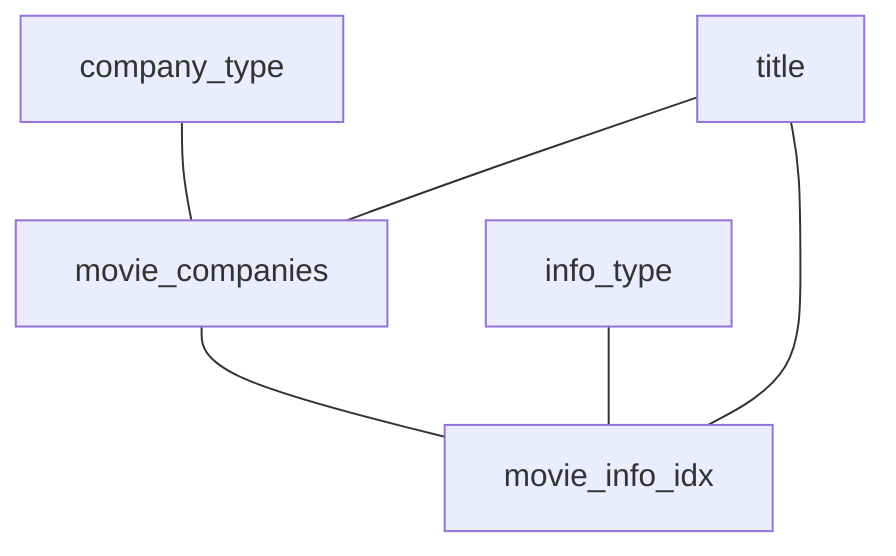

# Q1a

### Original Query
```sql
SELECT mc.note AS production_note,
       t.title AS movie_title,
       t.production_year AS movie_year
FROM company_type AS ct,
     info_type AS it,
     movie_companies AS mc,
     movie_info_idx AS mi_idx,
     title AS t
WHERE ct.kind = 'production companies'
  AND it.info = 'top 250 rank'
  AND NOT (mc.note LIKE '%(as Metro-Goldwyn-Mayer Pictures)%')
  AND (mc.note LIKE '%(co-production)%'
       OR mc.note LIKE '%(presents)%')
  AND ct.id = mc.company_type_id
  AND t.id = mc.movie_id
  AND t.id = mi_idx.movie_id
  AND mc.movie_id = mi_idx.movie_id
  AND it.id = mi_idx.info_type_id;
```
### Result Set Size
```sql
SELECT  COUNT(*),
        SUM(length(mc.note)),
        SUM(length(t.title)),
        COUNT(t.production_year) * 4
```
* 142 rows
* `mc.note`: 2527 byte
* `t.title`: 2520 byte
* `t.production_year`: 568 byte

$\rightarrow$ 5615 bytes

### Query Graph



### Result DB
```sql
SELECT SUM(length(nested.note)),
       COUNT(nested.movie_id) * 4, --post-join
       COUNT(*)
FROM (
SELECT DISTINCT mc.note,
                mc.movie_id -- post-join
FROM company_type AS ct,
     info_type AS it,
     movie_companies AS mc,
     movie_info_idx AS mi_idx,
     title AS t
WHERE ct.kind = 'production companies'
  AND it.info = 'top 250 rank'
  AND NOT (mc.note LIKE '%(as Metro-Goldwyn-Mayer Pictures)%')
  AND (mc.note LIKE '%(co-production)%'
       OR mc.note LIKE '%(presents)%')
  AND ct.id = mc.company_type_id
  AND t.id = mi_idx.movie_id
  AND mc.movie_id = mi_idx.movie_id
  AND it.id = mi_idx.info_type_id
) AS nested;
```
* w/ post-join:
    * 116 rows
    * `mc.note`: 2212 byte
    * `mc.movie_id`: 464 byte

* w/o post-join (i.e. w/o movie_id):
    * 35 rows
    * `mc.note`: 1303 byte

```sql
SELECT SUM(length(nested.title)),
       COUNT(nested.production_year) * 4,
       COUNT(nested.id) * 4, -- post-join
       COUNT(*)
FROM (
SELECT DISTINCT t.title,
                t.production_year,
                t.id -- post-join
FROM company_type AS ct,
     info_type AS it,
     movie_companies AS mc,
     movie_info_idx AS mi_idx,
     title AS t
WHERE ct.kind = 'production companies'
  AND it.info = 'top 250 rank'
  AND NOT (mc.note LIKE '%(as Metro-Goldwyn-Mayer Pictures)%')
  AND (mc.note LIKE '%(co-production)%'
       OR mc.note LIKE '%(presents)%')
  AND ct.id = mc.company_type_id
  AND t.id = mi_idx.movie_id
  AND mc.movie_id = mi_idx.movie_id
  AND it.id = mi_idx.info_type_id
) AS nested;
```
* 105 rows (no difference for post-join)
* `t.title`: 1856 byte
* `t.production_year`: 420 byte
* `t.id`: 420 byte

$\rightarrow$ w/ post-join: 2212 + 464 + 1856 + 420 + 420 = 5372 byte

$\rightarrow$ w/o post-join: 1303 + 1856 + 420 = 3579 byte
