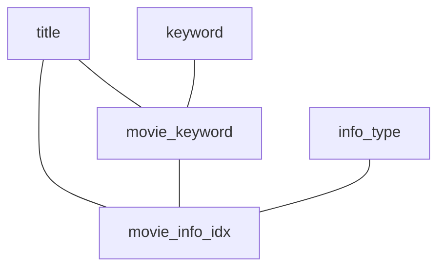

# Q4a

### Original Query
```sql
SELECT mi_idx.info AS rating,
       t.title AS movie_title
FROM info_type AS it,
     keyword AS k,
     movie_info_idx AS mi_idx,
     movie_keyword AS mk,
     title AS t
WHERE it.info = 'rating'
  AND k.keyword LIKE '%sequel%'
  AND mi_idx.info > '5.0'
  AND t.production_year > 2005
  AND t.id = mi_idx.movie_id
  AND t.id = mk.movie_id
  AND mk.movie_id = mi_idx.movie_id
  AND k.id = mk.keyword_id
  AND it.id = mi_idx.info_type_id;
```
### Result Set Size
```sql
SELECT  COUNT(*),
        SUM(length(mi_idx.info)),
        SUM(length(t.title))
```
* 740 rows
* `mid_idx.info`: 2220 byte
* `t.title`: 17143 byte

$\rightarrow$ 19363 bytes

### Query Graph



### Result DB
```sql
SELECT  SUM(length(nested.info)),
        COUNT(nested.movie_id) * 4, -- post-join
        COUNT(*)
FROM(
SELECT DISTINCT mi_idx.info,
                mi_idx.movie_id -- post-join
FROM info_type AS it,
     keyword AS k,
     movie_info_idx AS mi_idx,
     movie_keyword AS mk,
     title AS t
WHERE it.info = 'rating'
  AND k.keyword LIKE '%sequel%'
  AND mi_idx.info > '5.0'
  AND t.production_year > 2005
  AND t.id = mi_idx.movie_id
  AND t.id = mk.movie_id
  AND mk.movie_id = mi_idx.movie_id
  AND k.id = mk.keyword_id
  AND it.id = mi_idx.info_type_id
) AS nested;
```
* w/ post-join:
    * 564 rows
    * `mi_idx.info`: 1692 byte
    * `mi_idx.movie_id`: 2256 byte

* w/o post-join (i.e. w/o movie_id):
    * 45 rows
    * `mi_idx.info`: 135 byte

```sql
SELECT  SUM(length(nested.title)),
        COUNT(nested.id) * 4, -- post-join
        COUNT(*)
FROM(
SELECT DISTINCT t.title,
                t.id -- post-join
FROM info_type AS it,
     keyword AS k,
     movie_info_idx AS mi_idx,
     movie_keyword AS mk,
     title AS t
WHERE it.info = 'rating'
  AND k.keyword LIKE '%sequel%'
  AND mi_idx.info > '5.0'
  AND t.production_year > 2005
  AND t.id = mi_idx.movie_id
  AND t.id = mk.movie_id
  AND mk.movie_id = mi_idx.movie_id
  AND k.id = mk.keyword_id
  AND it.id = mi_idx.info_type_id
) AS nested;
```
* 564 rows (no difference for post-join)
* `t.title`: 13328 byte
* `t.id`: 2256 byte

$\rightarrow$ w/ post-join: 13328 + 2256 + 1692 + 2256 = 19532 byte

$\rightarrow$ w/o post-join: 13328 + 2256 + 135 = 15719 byte
