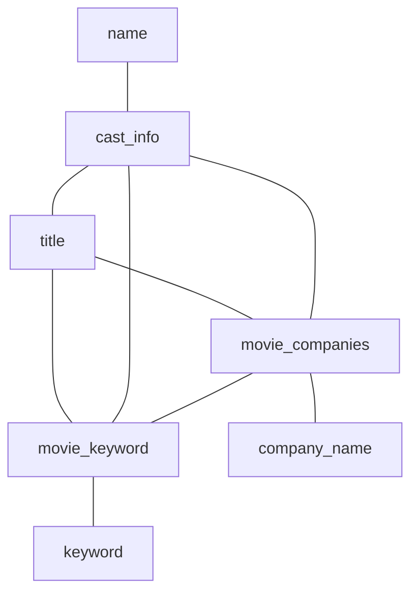

# Q17a

### Original Query
```sql
SELECT
	n.name,
    n.name
FROM
	cast_info AS ci,
	company_name AS cn,
	keyword AS k,
	movie_companies AS mc,
	movie_keyword AS mk,
	name AS n,
	title AS t
 WHERE
	cn.country_code = '[us]' AND
	k.keyword = 'character-name-in-title' AND
	n.name LIKE 'B%' AND
	n.id = ci.person_id AND
	ci.movie_id = t.id AND
	t.id = mk.movie_id AND
	mk.keyword_id = k.id AND
	t.id = mc.movie_id AND
	mc.company_id = cn.id AND
	ci.movie_id = mc.movie_id AND
	ci.movie_id = mk.movie_id AND
	mc.movie_id = mk.movie_id;
```
### Result Set Size
```sql
SELECT  COUNT(*),
        SUM(length(n.name)),
        SUM(length(n.name))
```
* 258289 rows
* `n.name`: 3655457 byte
* `n.name`: 3655457 byte

$\rightarrow$ 2 * 3655457 bytes

### Query Graph



#### Query Execution Plan
```sql
 Nested Loop  (cost=8.92..4588.80 rows=111 width=15) (actual time=4.234..8248.840 rows=258289 loops=1)
   ->  Nested Loop  (cost=8.49..4031.20 rows=1218 width=4) (actual time=4.199..2369.427 rows=2832555 loops=1)
         Join Filter: (ci.movie_id = t.id)
         ->  Nested Loop  (cost=8.05..3917.43 rows=63 width=12) (actual time=4.006..610.835 rows=68316 loops=1)
               ->  Nested Loop  (cost=7.63..3838.49 rows=177 width=16) (actual time=3.977..255.273 rows=148552 loops=1)
                     Join Filter: (mc.movie_id = t.id)
                     ->  Nested Loop  (cost=7.20..3818.05 rows=34 width=8) (actual time=3.950..114.790 rows=41840 loops=1)
                           ->  Nested Loop  (cost=6.77..3802.56 rows=34 width=4) (actual time=3.939..42.500 rows=41840 loops=1)
                                 ->  Seq Scan on keyword k  (cost=0.00..2685.12 rows=1 width=4) (actual time=0.419..7.920 rows=1 loops=1)
                                       Filter: (keyword = 'character-name-in-title'::text)
                                       Rows Removed by Filter: 134169
                                 ->  Bitmap Heap Scan on movie_keyword mk  (cost=6.77..1114.42 rows=302 width=8) (actual time=3.518..30.837 rows=41840 loops=1)
                                       Recheck Cond: (k.id = keyword_id)
                                       Heap Blocks: exact=11541
                                       ->  Bitmap Index Scan on keyword_id_movie_keyword  (cost=0.00..6.70 rows=302 width=0) (actual time=2.284..2.284 rows=41840 loops=1)
                                             Index Cond: (keyword_id = k.id)
                           ->  Index Only Scan using title_pkey on title t  (cost=0.43..0.46 rows=1 width=4) (actual time=0.001..0.001 rows=1 loops=41840)
                                 Index Cond: (id = mk.movie_id)
                                 Heap Fetches: 0
                     ->  Index Scan using movie_id_movie_companies on movie_companies mc  (cost=0.43..0.54 rows=5 width=8) (actual time=0.002..0.003 rows=4 loops=41840)
                           Index Cond: (movie_id = mk.movie_id)
               ->  Index Scan using company_name_pkey on company_name cn  (cost=0.42..0.45 rows=1 width=4) (actual time=0.002..0.002 rows=0 loops=148552)
                     Index Cond: (id = mc.company_id)
                     Filter: ((country_code)::text = '[us]'::text)
                     Rows Removed by Filter: 1
         ->  Index Scan using movie_id_cast_info on cast_info ci  (cost=0.44..1.34 rows=37 width=8) (actual time=0.002..0.021 rows=41 loops=68316)
               Index Cond: (movie_id = mk.movie_id)
   ->  Index Scan using name_pkey on name n  (cost=0.43..0.46 rows=1 width=19) (actual time=0.002..0.002 rows=0 loops=2832555)
         Index Cond: (id = ci.person_id)
         Filter: (name ~~ 'B%'::text)
         Rows Removed by Filter: 1
 Planning Time: 4.284 ms
 Execution Time: 8256.429 ms
(33 rows)
```

### Rewrite Method 3: Dynamic Subquery
```sql
SELECT DISTINCT
	n.name,
    n.name
FROM name AS n
WHERE
	n.name LIKE 'B%' AND
		(n.id) IN (
		SELECT
			ci.person_id
		FROM
			cast_info AS ci,
			title AS t,
			movie_companies AS mc,
			movie_keyword AS mk,
			company_name AS cn,
			keyword AS k
		WHERE
			cn.country_code = '[us]' AND
			k.keyword = 'character-name-in-title' AND
			ci.movie_id = mk.movie_id AND
			ci.movie_id = t.id AND
			t.id = mc.movie_id AND
			mc.company_id = cn.id AND
			mc.movie_id = mk.movie_id AND
			ci.movie_id = mc.movie_id AND
			t.id = mk.movie_id AND
			mk.keyword_id = k.id
	);
```

#### Query Execution Plan
```sql
 Unique  (cost=4542.09..4542.17 rows=16 width=15) (actual time=3786.174..3791.314 rows=27434 loops=1)
   ->  Sort  (cost=4542.09..4542.13 rows=16 width=15) (actual time=3786.172..3787.427 rows=28584 loops=1)
         Sort Key: n.name
         Sort Method: quicksort  Memory: 1505kB
         ->  Nested Loop  (cost=3876.65..4541.77 rows=16 width=15) (actual time=2588.140..3769.386 rows=28584 loops=1)
               ->  HashAggregate  (cost=3876.22..3878.01 rows=179 width=4) (actual time=2588.116..2649.961 rows=322169 loops=1)
                     Group Key: ci.person_id
                     Batches: 1  Memory Usage: 28705kB
                     ->  Nested Loop  (cost=8.49..3875.77 rows=179 width=4) (actual time=4.128..2176.976 rows=2832555 loops=1)
                           Join Filter: (t.id = ci.movie_id)
                           ->  Nested Loop  (cost=8.05..3854.10 rows=12 width=12) (actual time=3.935..546.843 rows=68316 loops=1)
                                 ->  Nested Loop  (cost=7.63..3838.49 rows=35 width=16) (actual time=3.906..244.605 rows=148552 loops=1)
                                       Join Filter: (mc.movie_id = t.id)
                                       ->  Nested Loop  (cost=7.20..3818.05 rows=34 width=8) (actual time=3.881..108.442 rows=41840 loops=1)
                                             ->  Nested Loop  (cost=6.77..3802.56 rows=34 width=4) (actual time=3.872..41.206 rows=41840 loops=1)
                                                   ->  Seq Scan on keyword k  (cost=0.00..2685.12 rows=1 width=4) (actual time=0.424..7.999 rows=1 loops=1)
                                                         Filter: (keyword = 'character-name-in-title'::text)
                                                         Rows Removed by Filter: 134169
                                                   ->  Bitmap Heap Scan on movie_keyword mk  (cost=6.77..1114.42 rows=302 width=8) (actual time=3.446..29.710 rows=41840 loops=1)
                                                         Recheck Cond: (k.id = keyword_id)
                                                         Heap Blocks: exact=11541
                                                         ->  Bitmap Index Scan on keyword_id_movie_keyword  (cost=0.00..6.70 rows=302 width=0) (actual time=2.210..2.210 rows=41840 loops=1)
                                                               Index Cond: (keyword_id = k.id)
                                             ->  Index Only Scan using title_pkey on title t  (cost=0.43..0.46 rows=1 width=4) (actual time=0.001..0.001 rows=1 loops=41840)
                                                   Index Cond: (id = mk.movie_id)
                                                   Heap Fetches: 0
                                       ->  Index Scan using movie_id_movie_companies on movie_companies mc  (cost=0.43..0.54 rows=5 width=8) (actual time=0.002..0.003 rows=4 loops=41840)
                                             Index Cond: (movie_id = mk.movie_id)
                                 ->  Index Scan using company_name_pkey on company_name cn  (cost=0.42..0.45 rows=1 width=4) (actual time=0.002..0.002 rows=0 loops=148552)
                                       Index Cond: (id = mc.company_id)
                                       Filter: ((country_code)::text = '[us]'::text)
                                       Rows Removed by Filter: 1
                           ->  Index Scan using movie_id_cast_info on cast_info ci  (cost=0.44..1.34 rows=37 width=8) (actual time=0.002..0.020 rows=41 loops=68316)
                                 Index Cond: (movie_id = mk.movie_id)
               ->  Index Scan using name_pkey on name n  (cost=0.43..3.71 rows=1 width=19) (actual time=0.003..0.003 rows=0 loops=322169)
                     Index Cond: (id = ci.person_id)
                     Filter: (name ~~ 'B%'::text)
                     Rows Removed by Filter: 1
 Planning Time: 4.201 ms
 Execution Time: 3792.583 ms
(40 rows)
```

### Result DB
```sql
SELECT  SUM(length(nested.name)),
        SUM(length(nested.name)),
        COUNT(*)
FROM(
SELECT DISTINCT n.name
FROM
	cast_info AS ci,
	company_name AS cn,
	keyword AS k,
	movie_companies AS mc,
	movie_keyword AS mk,
	name AS n,
	title AS t
 WHERE
	cn.country_code = '[us]' AND
	k.keyword = 'character-name-in-title' AND
	n.name LIKE 'B%' AND
	n.id = ci.person_id AND
	ci.movie_id = t.id AND
	t.id = mk.movie_id AND
	mk.keyword_id = k.id AND
	t.id = mc.movie_id AND
	mc.company_id = cn.id AND
	ci.movie_id = mc.movie_id AND
	ci.movie_id = mk.movie_id AND
	mc.movie_id = mk.movie_id
) AS nested;
```
* w/ and w/o post-join (only one attribute returned)
    * 27434 rows
    * `n.name`: 394165 byte
    * `n.name`: 394165 byte


## Memory Consumption
* Standard Optimizer:
    * Pre-allocated memory consumption: 0 MiB
    * Allocated memory consumption: 1784.57 MiB
* ResultDB:
    * Pre-allocated memory consumption: 0 MiB
    * Allocated memory consumption: 1101.86 MiB
