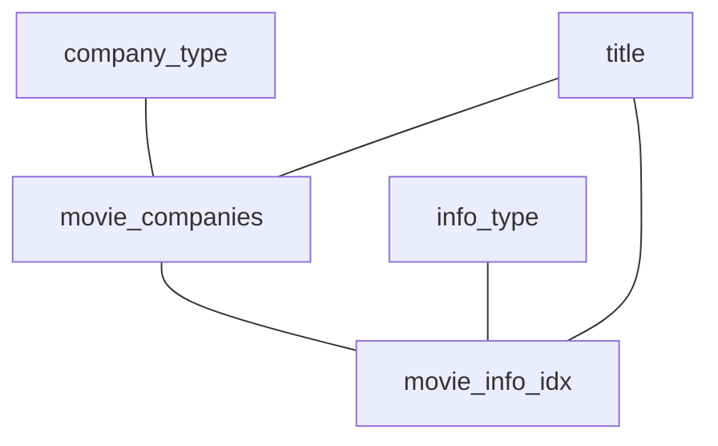

# Q1a

### Original Query
```sql
SELECT mc.note AS production_note,
       t.title AS movie_title,
       t.production_year AS movie_year
FROM company_type AS ct,
     info_type AS it,
     movie_companies AS mc,
     movie_info_idx AS mi_idx,
     title AS t
WHERE ct.kind = 'production companies'
  AND it.info = 'top 250 rank'
  AND NOT (mc.note LIKE '%(as Metro-Goldwyn-Mayer Pictures)%')
  AND (mc.note LIKE '%(co-production)%'
       OR mc.note LIKE '%(presents)%')
  AND ct.id = mc.company_type_id
  AND t.id = mc.movie_id
  AND t.id = mi_idx.movie_id
  AND mc.movie_id = mi_idx.movie_id
  AND it.id = mi_idx.info_type_id;
```
### Result Set Size
```sql
SELECT  COUNT(*),
        SUM(length(mc.note)),
        SUM(length(t.title)),
        COUNT(t.production_year) * 4
```
* 142 rows
* `mc.note`: 2527 byte
* `t.title`: 2520 byte
* `t.production_year`: 568 byte

$\rightarrow$ 5615 bytes

### Query Graph



### Result DB
```sql
SELECT SUM(length(nested.note)),
       COUNT(nested.movie_id) * 4, --post-join
       COUNT(*)
FROM (
SELECT DISTINCT mc.note,
                mc.movie_id -- post-join
FROM company_type AS ct,
     info_type AS it,
     movie_companies AS mc,
     movie_info_idx AS mi_idx,
     title AS t
WHERE ct.kind = 'production companies'
  AND it.info = 'top 250 rank'
  AND NOT (mc.note LIKE '%(as Metro-Goldwyn-Mayer Pictures)%')
  AND (mc.note LIKE '%(co-production)%'
       OR mc.note LIKE '%(presents)%')
  AND ct.id = mc.company_type_id
  AND t.id = mi_idx.movie_id
  AND mc.movie_id = mi_idx.movie_id
  AND it.id = mi_idx.info_type_id
) AS nested;
```
* w/ post-join:
    * 116 rows
    * `mc.note`: 2212 byte
    * `mc.movie_id`: 464 byte

* w/o post-join (i.e. w/o movie_id):
    * 35 rows
    * `mc.note`: 1303 byte

```sql
SELECT SUM(length(nested.title)),
       COUNT(nested.production_year) * 4,
       COUNT(nested.id) * 4, -- post-join
       COUNT(*)
FROM (
SELECT DISTINCT t.title,
                t.production_year,
                t.id -- post-join
FROM company_type AS ct,
     info_type AS it,
     movie_companies AS mc,
     movie_info_idx AS mi_idx,
     title AS t
WHERE ct.kind = 'production companies'
  AND it.info = 'top 250 rank'
  AND NOT (mc.note LIKE '%(as Metro-Goldwyn-Mayer Pictures)%')
  AND (mc.note LIKE '%(co-production)%'
       OR mc.note LIKE '%(presents)%')
  AND ct.id = mc.company_type_id
  AND t.id = mi_idx.movie_id
  AND mc.movie_id = mi_idx.movie_id
  AND it.id = mi_idx.info_type_id
) AS nested;
```
* 105 rows (no difference for post-join)
* `t.title`: 1856 byte
* `t.production_year`: 420 byte
* `t.id`: 420 byte

$\rightarrow$ w/ post-join: 2212 + 464 + 1856 + 420 + 420 = 5372 byte

$\rightarrow$ w/o post-join: 1303 + 1856 + 420 = 3579 byte


### Memory Consumption
* Standard Optimizer:
    * Pre-allocated memory consumption: 0 MiB
    * Allocated memory consumption: 18606.1 MiB
* ResultDB:
    * Pre-allocated memory consumption: 0 MiB
    * Allocated memory consumption: 20126.1 MiB


### PostgreSQL Performance

```
 Gather  (cost=1003.45..19521.19 rows=2 width=45) (actual time=61.018..70.677 rows=142 loops=1)
   Workers Planned: 2
   Workers Launched: 2
   ->  Nested Loop  (cost=3.45..18520.99 rows=1 width=45) (actual time=57.666..59.639 rows=47 loops=3)
         Join Filter: (mc.movie_id = t.id)
         ->  Nested Loop  (cost=3.02..18520.40 rows=1 width=32) (actual time=57.630..59.410 rows=47 loops=3)
               ->  Nested Loop  (cost=2.86..18515.36 rows=181 width=36) (actual time=57.618..59.381 rows=49 loops=3)
                     ->  Hash Join  (cost=2.43..15286.60 rows=5089 width=4) (actual time=57.564..57.591 rows=83 loops=3)
                           Hash Cond: (mi_idx.info_type_id = it.id)
                           ->  Parallel Seq Scan on movie_info_idx mi_idx  (cost=0.00..13718.15 rows=575015 width=8) (actual time=0.009..25.208 rows=460012 loops=3)
                           ->  Hash  (cost=2.41..2.41 rows=1 width=4) (actual time=0.030..0.030 rows=1 loops=3)
                                 Buckets: 1024  Batches: 1  Memory Usage: 9kB
                                 ->  Seq Scan on info_type it  (cost=0.00..2.41 rows=1 width=4) (actual time=0.023..0.023 rows=1 loops=3)
                                       Filter: ((info)::text = 'top 250 rank'::text)
                                       Rows Removed by Filter: 112
                     ->  Index Scan using movie_id_movie_companies on movie_companies mc  (cost=0.43..0.62 rows=1 width=32) (actual time=0.021..0.021 rows=1 loops=250)
                           Index Cond: (movie_id = mi_idx.movie_id)
                           Filter: ((note !~~ '%(as Metro-Goldwyn-Mayer Pictures)%'::text) AND ((note ~~ '%(co-production)%'::text) OR (note ~~ '%(presents)%'::text)))
                           Rows Removed by Filter: 33
               ->  Memoize  (cost=0.16..0.18 rows=1 width=4) (actual time=0.000..0.000 rows=1 loops=147)
                     Cache Key: mc.company_type_id
                     Cache Mode: logical
                     Hits: 94  Misses: 1  Evictions: 0  Overflows: 0  Memory Usage: 1kB
                     Worker 0:  Hits: 50  Misses: 2  Evictions: 0  Overflows: 0  Memory Usage: 1kB
                     ->  Index Scan using company_type_pkey on company_type ct  (cost=0.15..0.17 rows=1 width=4) (actual time=0.010..0.010 rows=1 loops=3)
                           Index Cond: (id = mc.company_type_id)
                           Filter: ((kind)::text = 'production companies'::text)
                           Rows Removed by Filter: 0
         ->  Index Scan using title_pkey on title t  (cost=0.43..0.58 rows=1 width=25) (actual time=0.004..0.004 rows=1 loops=142)
               Index Cond: (id = mi_idx.movie_id)
 Planning Time: 0.735 ms
 Execution Time: 70.719 ms
```
