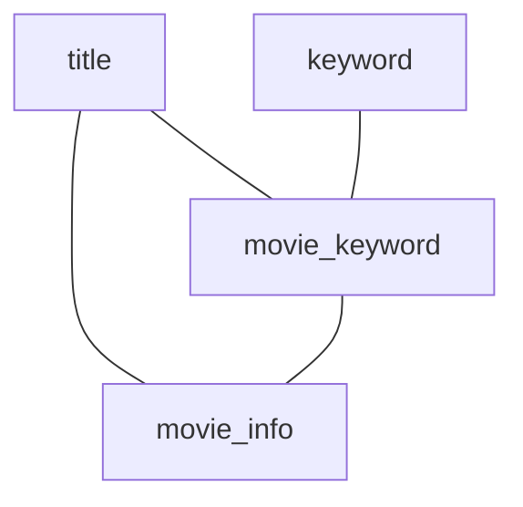

# Q3b

### Original Query
```sql
SELECT t.title
FROM keyword AS k,
     movie_info AS mi,
     movie_keyword AS mk,
     title AS t
WHERE k.keyword LIKE '%sequel%'
  AND mi.info = 'Bulgaria'
  AND t.production_year > 2010
  AND t.id = mi.movie_id
  AND t.id = mk.movie_id
  AND mk.movie_id = mi.movie_id
  AND k.id = mk.keyword_id;
```

### Result Set Size
```sql
SELECT  COUNT(*),
        SUM(length(t.title))
```
* 5 rows
* `t.title`: 85 byte

$\rightarrow$ 85 bytes

### Query Graph



### Result DB
```sql
SELECT SUM(length(nested.title)),
       COUNT(*)
FROM (
SELECT DISTINCT t.title
FROM keyword AS k,
     movie_info AS mi,
     movie_keyword AS mk,
     title AS t
WHERE k.keyword LIKE '%sequel%'
  AND mi.info = 'Bulgaria'
  AND t.production_year > 2010
  AND t.id = mi.movie_id
  AND t.id = mk.movie_id
  AND mk.movie_id = mi.movie_id
  AND k.id = mk.keyword_id
) AS nested;
```
* w/o post-join (only one relation returned):
    * 3 rows
    * `t.title`: 51 byte

$\rightarrow$ w/o post-join: 51 byte


## Intermediate Result Set Sizes (for injected cardinalities)
### Base Relations
```sql
SELECT COUNT(*)
FROM keyword AS k
WHERE k.keyword LIKE '%sequel%';
```

```sql
SELECT COUNT(*)
FROM movie_info AS mi
WHERE mi.info = 'Bulgaria';
```

```sql
SELECT COUNT(*)
FROM movie_keyword AS mk
```

```sql
SELECT COUNT(*)
FROM title AS t
WHERE t.production_year > 2010;
```

### Subproblem size = 2

```sql
SELECT COUNT(*)
FROM title AS t,
     movie_info AS mi
WHERE t.production_year > 2010 AND
      mi.info = 'Bulgaria' AND
      t.id = mi.movie_id;
```

```sql
SELECT COUNT(*)
FROM title AS t,
     movie_keyword AS mk
WHERE t.production_year > 2010 AND
      t.id = mk.movie_id;
```

```sql
SELECT COUNT(*)
FROM movie_info AS mi,
     movie_keyword AS mk
WHERE mi.info = 'Bulgaria' AND
      mi.movie_id = mk.movie_id;
```

```sql
SELECT COUNT(*)
FROM keyword AS k,
     movie_keyword AS mk
WHERE k.keyword LIKE '%sequel%' AND
      k.id = mk.keyword_id;
```

### Subproblem size = 3
```sql
SELECT COUNT(*)
FROM title AS t,
     movie_keyword AS mk,
     movie_info AS mi
WHERE t.production_year > 2010 AND
      mi.info = 'Bulgaria' AND
      t.id = mi.movie_id AND
      t.id = mk.movie_id AND
      mi.movie_id = mk.movie_id;
```

```sql
SELECT COUNT(*)
FROM title AS t,
     movie_keyword AS mk,
     keyword AS k
WHERE t.production_year > 2010 AND
      k.keyword LIKE '%sequel%' AND
      t.id = mk.movie_id AND
      mk.keyword_id = k.id;
```

```sql
SELECT COUNT(*)
FROM movie_info AS mi,
     movie_keyword AS mk,
     keyword AS k
WHERE mi.info = 'Bulgaria' AND
      k.keyword LIKE '%sequel%' AND
      mi.movie_id = mk.movie_id AND
      mk.keyword_id = k.id;
```

### Subproblem size = 4
```sql
SELECT COUNT(*)
FROM keyword AS k,
     movie_info AS mi,
     movie_keyword AS mk,
     title AS t
WHERE k.keyword LIKE '%sequel%'
  AND mi.info = 'Bulgaria'
  AND t.production_year > 2010
  AND t.id = mi.movie_id
  AND t.id = mk.movie_id
  AND mk.movie_id = mi.movie_id
  AND k.id = mk.keyword_id;
```

### Memory Consumption
* Standard Optimizer:
    * Pre-allocated memory consumption: 0 MiB
    * Allocated memory consumption: 96.0952 MiB
* ResultDB:
    * Pre-allocated memory consumption: 0 MiB
    * Allocated memory consumption: 285.171 MiB
