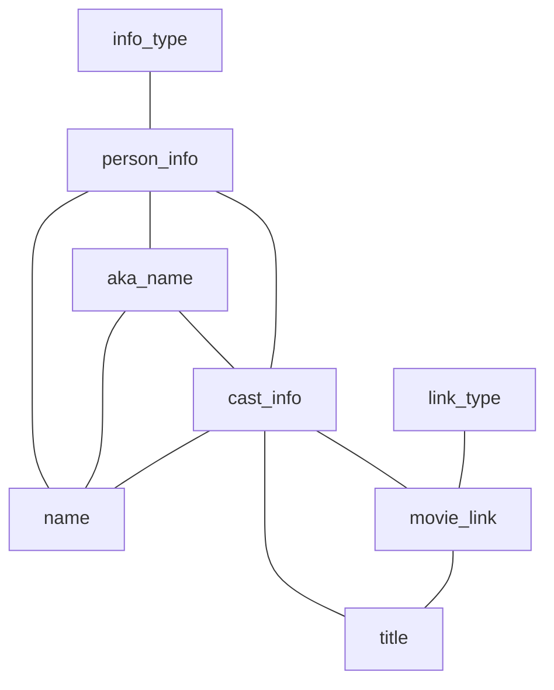

# Q7b

## Original Query
```sql
SELECT n.name,
       t.title
FROM aka_name AS an,
     cast_info AS ci,
     info_type AS it,
     link_type AS lt,
     movie_link AS ml,
     name AS n,
     person_info AS pi,
     title AS t
WHERE an.name LIKE '%a%'
  AND it.info = 'mini biography'
  AND lt.link = 'features'
  AND n.name_pcode_cf LIKE 'D%'
  AND n.gender= 'm'
  AND pi.note = 'Volker Boehm'
  AND t.production_year >= 1980
  AND t.production_year <= 1984
  AND n.id = an.person_id
  AND n.id = pi.person_id
  AND ci.person_id = n.id
  AND t.id = ci.movie_id
  AND ml.linked_movie_id = t.id
  AND lt.id = ml.link_type_id
  AND it.id = pi.info_type_id
  AND pi.person_id = an.person_id
  AND pi.person_id = ci.person_id
  AND an.person_id = ci.person_id
  AND ci.movie_id = ml.linked_movie_id;
```
### Result Set Size
```sql
SELECT  COUNT(*),
        SUM(length(n.name)),
        SUM(length(t.title))
```
* 16 rows
* `n.name`: 240 byte
* `t.title`: 156 byte

$\rightarrow$ 240 + 156 = 396 bytes

### Query Graph



## Result DB
#### name
```sql
SELECT  COUNT(*),
        SUM(length(nested.name)),
        COUNT(nested.id) * 4
FROM(
SELECT DISTINCT n.id,
                n.name
FROM aka_name AS an,
     cast_info AS ci,
     info_type AS it,
     link_type AS lt,
     movie_link AS ml,
     name AS n,
     person_info AS pi,
     title AS t
WHERE an.name LIKE '%a%'
  AND it.info = 'mini biography'
  AND lt.link = 'features'
  AND n.name_pcode_cf LIKE 'D%'
  AND n.gender= 'm'
  AND pi.note = 'Volker Boehm'
  AND t.production_year >= 1980
  AND t.production_year <= 1984
  AND n.id = an.person_id
  AND n.id = pi.person_id
  AND ci.person_id = n.id
  AND t.id = ci.movie_id
  AND ml.linked_movie_id = t.id
  AND lt.id = ml.link_type_id
  AND it.id = pi.info_type_id
  AND pi.person_id = an.person_id
  AND pi.person_id = ci.person_id
  AND an.person_id = ci.person_id
  AND ci.movie_id = ml.linked_movie_id
) AS nested;
```
* w/ post-join:
    * 1 rows
    * `n.name`: 15 byte
    * `n.id`: 4 byte

* w/o post-join:
    * 1 rows
    * `n.name`: 15 byte

#### cast_info
```sql
SELECT  COUNT(*),
        SUM(length(nested.person_id)) * 4,
        COUNT(nested.movie_id) * 4
FROM(
SELECT DISTINCT ci.person_id,
                ci.movie_id
FROM aka_name AS an,
     cast_info AS ci,
     info_type AS it,
     link_type AS lt,
     movie_link AS ml,
     name AS n,
     person_info AS pi,
     title AS t
WHERE an.name LIKE '%a%'
  AND it.info = 'mini biography'
  AND lt.link = 'features'
  AND n.name_pcode_cf LIKE 'D%'
  AND n.gender= 'm'
  AND pi.note = 'Volker Boehm'
  AND t.production_year >= 1980
  AND t.production_year <= 1984
  AND n.id = an.person_id
  AND n.id = pi.person_id
  AND ci.person_id = n.id
  AND t.id = ci.movie_id
  AND ml.linked_movie_id = t.id
  AND lt.id = ml.link_type_id
  AND it.id = pi.info_type_id
  AND pi.person_id = an.person_id
  AND pi.person_id = ci.person_id
  AND an.person_id = ci.person_id
  AND ci.movie_id = ml.linked_movie_id
) AS nested;
```
* w/ post-join (only required for post-join):
    * 2 rows
    * `ci.person_id`: 8 byte
    * `ci.movie_id`: 8 byte

#### title
```sql
SELECT  COUNT(*),
        SUM(length(nested.title)),
        COUNT(nested.id) * 4
FROM(
SELECT DISTINCT t.title,
                t.id
FROM aka_name AS an,
     cast_info AS ci,
     info_type AS it,
     link_type AS lt,
     movie_link AS ml,
     name AS n,
     person_info AS pi,
     title AS t
WHERE an.name LIKE '%a%'
  AND it.info = 'mini biography'
  AND lt.link = 'features'
  AND n.name_pcode_cf LIKE 'D%'
  AND n.gender= 'm'
  AND pi.note = 'Volker Boehm'
  AND t.production_year >= 1980
  AND t.production_year <= 1984
  AND n.id = an.person_id
  AND n.id = pi.person_id
  AND ci.person_id = n.id
  AND t.id = ci.movie_id
  AND ml.linked_movie_id = t.id
  AND lt.id = ml.link_type_id
  AND it.id = pi.info_type_id
  AND pi.person_id = an.person_id
  AND pi.person_id = ci.person_id
  AND an.person_id = ci.person_id
  AND ci.movie_id = ml.linked_movie_id
) AS nested;
```
* w/ post-join:
    * 2 rows
    * `t.title`: 23 byte
    * `t.id`: 8 byte

* w/o post-join
    * 2 rows
    * `t.title`: 23 byte

$\rightarrow$ w/ post-join: 23 + 8 + 8 + 8 + 15 + 4 = 66 byte

$\rightarrow$ w/o post-join: 23 + 15 = 38 byte

### Memory Consumption
* Standard Optimizer:
    * Pre-allocated memory consumption: 0 MiB
    * Allocated memory consumption: 1036.69 MiB
* ResultDB:
    * Pre-allocated memory consumption: 0 MiB
    * Allocated memory consumption: 1101.86 MiB
